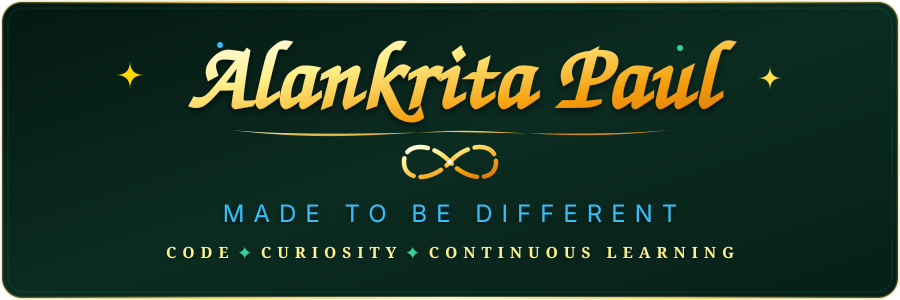

<!-- Calligraphy Header Banner -->

  

<!-- Dynamic Animated Rotating Subtitles (Distinct Styles & Vibrant Colors) -->

  

---

<!-- Live Tic-Tac-Toe Game (Keeping the game only) -->

  

---

<!-- Programmer Dialogue / Reality Check -->

> ### 💭 Reality Check:
> **What happens when code runs on the first try?**  
> **Ans —** We don't debug it.  
> &nbsp;&nbsp;&nbsp;&nbsp;&nbsp;&nbsp;&nbsp;&nbsp;&nbsp;&nbsp;&nbsp;**We Commit and Push before it Change.** 🚀

---

### 🛠️ TECH STACK & ARSENAL

  
  
  
  
  
  
  
  
  

---

### 🚀 FEATURED HIGHLIGHTS

| Repository | Focus | Tech Stack | Status |
| :--- | :--- | :--- | :--- |
| 🛍️ **[E-Commerce-IQ](https://github.com/AlankritaPaul/E-Commerce-IQ)** | Intelligent real-time analytics & intelligence engine | Python, Streamlit, Data Pipeline | ⚡ Active |
| 🔄 **[Sync](https://github.com/AlankritaPaul/Sync)** | Automation & real-time sync architecture | Python, Shell, Git | ⚡ Active |

---

  <i>"Code. Curiosity. Continuous Learning." — Alankrita Paul</i>

